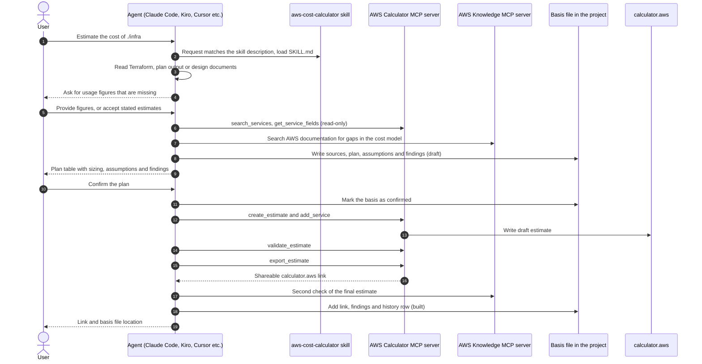

# Agent skill: aws-cost-calculator

Build [AWS Pricing Calculator](https://calculator.aws) estimates from your Terraform, design documents or a list of services, using the coding agent you already work in. Works with Claude Code, Kiro, Cursor and any other agent that supports Agent Skills and MCP.

- **Output:** a shareable `calculator.aws` link, plus a markdown file with every input and assumption behind the estimate. The file is written before the estimate is built, so it can go into git alongside the code it describes.
- **Input:** Infrastructure as Code (Terraform, CloudFormation, CDK), design documents or a list of services. The agent asks for usage figures it cannot find and marks any it has to estimate.
- **Cost:** free. No AWS credentials needed.
- **Requirements:** Node.js and the AWS Pricing Calculator MCP server (installed with the plugin).
- **Setup:** Claude Code plugin, Kiro Power or Cursor plugin. See [Quick start](#quick-start).

## Challenges this solution addresses

Most AWS estimates are still built by hand in the [calculator](https://calculator.aws/)'s web UI. That has some well-known problems:

- **Manual and slow.** Services are added by clicking through forms, field by field, although the architecture already exists as Terraform or a design document.
- **Not reproducible.** The inputs live in a browser session and in someone's head. Another person, or the same person later, gets a different estimate, and the reasoning behind each number is not recorded.
- **Not scriptable.** The public calculator (`calculator.aws`) has no official API for creating estimates.
- **Incomplete by default.** The calculator does not prompt for common cost lines (root volumes, data transfer, backup storage, Multi-AZ, support plan) and does not model some billing details, such as management fees or minimum storage durations on archival tiers.
- **Unreliable when delegated to an AI.** Without tooling, an agent recalls prices from training data or scrapes pricing pages that render client-side. The numbers look authoritative but are not current, and no estimate exists that anyone can open.

## Why the output is a calculator estimate

- **It is easy to share.** A `calculator.aws` link can be sent to a customer or passed between teams in pre-sales, and the recipient can open and adjust it. A markdown table or a spreadsheet cannot be verified or edited the same way.
- **It is a common format.** Customers, AWS account teams and AWS Partners all work with calculator links, so the estimate does not have to be explained or rebuilt in someone else's tool.
- **AWS Partner processes require it.** For AWS Partners, Partner Central processes such as funding requests and opportunity deal sizing expect a Pricing Calculator estimate, and Partner Central can [import a calculator link](https://aws.amazon.com/about-aws/whats-new/2025/12/aws-partner-central-opportunity-deal-sizing) directly. A custom calculation rendered as markdown is not accepted there.

## How it works

The agent builds the estimate through an MCP server and follows the same steps every time:

1. **Inventory:** it lists the services from the Terraform plan, design document or user-supplied list, and asks for usage figures that were not given.
2. **Fact check:** it checks the design against current AWS documentation (AWS Knowledge MCP server) for cost components the calculator does not model, commitment-versus-workload mismatches and storage-class constraints.
3. **Record the basis:** it writes a markdown file (`cost-estimate/<name>.md` by default) with the sources, the plan table, an assumptions table that marks each input as confirmed or estimated, and the documentation findings. This happens before anything is built.
4. **Confirm:** it presents the plan table (service, sizing, key assumption) and waits for approval before anything is written to `calculator.aws`.
5. **Build:** it creates the estimate, validates it, and returns the shareable `calculator.aws` link. An estimate without a link is not considered done.
6. **Finalize:** it updates the same file with the link, the validation result, a second documentation check of the built estimate and a history row, and checks a list of commonly missed cost lines.

The basis file is plain markdown inside the project. Committed before and after the build, its git history is the changelog of the estimate: a changed assumption appears as a diff, and each rebuild adds a history row with its new link. The agent writes the file but never commits or pushes it.

### Sequence

Installing the plugin registers the skill and both MCP servers with the agent. At the start of each session the agent loads only the skill's name and description. The full instructions load when a request matches, or when the skill is invoked by name.



The basis file exists before the build, and nothing is written to `calculator.aws` until the user confirms the plan (message 10). The user can commit the basis file before and after the build.

| Agent | Automatic | By name |
|---|---|---|
| Claude Code | When the request matches the skill description | `/aws-cost-calculator:aws-cost-calculator` |
| Kiro | When the request matches the Power keywords or the skill description | `/aws-cost-calculator` |
| Cursor | When the request matches the skill description | Type `/` in Agent chat and search for `aws-cost-calculator` |

### Example

Illustrative; services, figures and the link are placeholders.

```text
You:    Estimate the monthly cost of this Terraform plan in eu-west-1.
        Peak load is about 50 requests per second.

Agent:  Basis written to cost-estimate/orders-platform.md (status: draft).
        Planned estimate. Please confirm before I create it:

        | Service        | Sizing                               | Key assumption                    |
        |----------------|--------------------------------------|-----------------------------------|
        | ALB            | 1 load balancer                      | 50 req/s peak (confirmed)         |
        | ECS Fargate    | 2 tasks, 0.5 vCPU / 1 GB             | Running 24/7 (estimated)          |
        | RDS PostgreSQL | db.t4g.medium, Multi-AZ, 100 GB gp3  | Multi-AZ as in the Terraform plan |

        Documentation check: <findings, for example cost lines the calculator does not model>

You:    go

Agent:  Estimate created and validated: https://calculator.aws/#/estimate?id=<id>
        Basis updated: cost-estimate/orders-platform.md (status: built).
        Commit it to keep the estimate's history in git.
```

## How to use it

Point your agent at whatever describes the solution: Terraform code, plan or state output, design documents, README files or architecture decision records. It identifies the AWS services and builds the estimate from there. For example:

```text
Analyze the Terraform in ./infra and produce an AWS Pricing Calculator estimate for eu-west-1.
Read docs/solution-design.md and estimate the monthly cost of the proposed architecture.
Estimate the production environment from this plan output, assuming 200 GB of data transfer per month.
```

The agent asks for any usage figures the material does not contain (request rate, data volume, run hours) before it builds anything, and it shows the plan table for approval first.

### Typical use cases

1. **Cost check on Terraform before it ships.** Estimate a new module or environment from the code or the plan, so cost is reviewed alongside the change instead of after the first bill.
2. **Baselining an existing deployment.** Estimate the running cost of an environment from its Terraform, for a handover, a managed-service price or a budget conversation.
3. **Comparing design options.** Run the skill once per option (for example single-AZ against Multi-AZ, or Fargate against EKS) and compare the resulting estimates, each with its own listed assumptions.
4. **Pre-sales proposals.** Turn a design document or architecture description into a `calculator.aws` link that can be sent to the customer and adjusted together with them.
5. **AWS Partner funding and opportunities.** Produce the Pricing Calculator estimate that MAP and POC requests attach, or that Partner Central imports for deal sizing, without re-typing the architecture into the UI.

## Benefits

| | Manual calculator | With this skill |
|---|---|---|
| Entering services | Re-typed in the UI, field by field | Taken from Infrastructure-as-Code or design document; the user reviews a table instead of filling forms |
| Reproducibility | Depends on the person | The same workflow every time, with every assumption listed and labelled confirmed or estimated |
| Traceability | Inputs are not recorded; a changed number cannot be explained later | A basis file in the project, written before the build; git history shows what changed between estimates |
| Verifiability | A total, possibly with a link | A `calculator.aws` link produced with AWS-calculated pricing, plus the assumptions table |
| Completeness | Whatever the user remembers | A fixed checklist of commonly missed cost lines, and documentation checks for gaps in the calculator's own model |
| Re-estimating after a change | Change and click in the UI | Change the input and re-run |

## Who it is for

- **Solutions Architects** estimating the cost of an AWS solution or a proposed design
- **Pre-sales engineers** who need an estimate that can be handed to a customer or reviewed internally
- **AWS Partner teams** preparing estimates for Partner Central processes such as opportunity deal sizing and funding requests
- Anyone who keeps an architecture in Terraform or a design document and needs the matching `calculator.aws` estimate

## Before installing

- The calculator MCP server is an AWS sample project that uses undocumented calculator APIs. It may change or break without notice.
- Estimates are planning figures, not AWS quotes. Every estimated input is listed in the assumptions table and should be reviewed.
- The AWS Knowledge MCP server used for the fact check is hosted by AWS, rate-limited, and receives the documentation queries the skill sends. Without it the skill still runs, but states that the architectural reasoning was not independently checked.

## Quick start

**Prerequisite:** [Node.js](https://nodejs.org/en/download). Check with `node --version`. No AWS account or credentials are needed.

The setup has two parts, two MCP servers and the skills:

| Component | Name in this repo | Role |
|---|---|---|
| [AWS Pricing Calculator MCP server](https://github.com/aws-samples/sample-aws-pricing-calculator-mcp) | `pricing-calculator` | Builds the estimate on `calculator.aws`. Required. |
| [AWS Knowledge MCP server](https://awslabs.github.io/mcp/servers/aws-knowledge-mcp-server) | `aws-knowledge` | Checks the design against AWS documentation. Strongly recommended. |
| Skills | `aws-cost-calculator`, `aws-cost-calculator-getting-started` | The estimating workflow, and a short onboarding guide |

Choose one option:

- **Option A, plugin:** Claude Code, Kiro or Cursor. One install sets up both servers and both skills.
- **Option B, manual:** any other agent, or if you prefer to set up each part yourself.

Then [verify the setup](#verify-the-setup).

### Option A: install as a plugin

#### Claude Code

1. Add the marketplace and install the plugin:

   ```text
   /plugin marketplace add haakond/aws-cost-calculator-skill
   /plugin install aws-cost-calculator@aws-cost-calculator
   ```

   On Claude Code 2.1.275 or later, one command does both: `/plugin install aws-cost-calculator --marketplace haakond/aws-cost-calculator-skill`.
2. Choose a scope when prompted, then run `/reload-plugins` if asked.
3. Run `claude plugin list` and check that `aws-cost-calculator` is enabled.
4. Continue with [Verify the setup](#verify-the-setup).

#### Kiro

1. Open the Powers panel and choose **Add Custom Power** → **Import power from GitHub**.
2. Enter `https://github.com/haakond/aws-cost-calculator-skill` and choose **Install**. For a local clone, choose **Import power from a folder** and select the clone's root directory.
3. In the MCP server list, check that `pricing-calculator` and `aws-knowledge` (prefixed with the Power name) show as **Connected**.
4. Continue with [Verify the setup](#verify-the-setup).

Do not also copy the skills into `~/.kiro/skills/`; they would be registered twice.

#### Cursor

1. Open **Customize** and choose **Add Marketplace** → **Import from Repo**.
2. Enter `https://github.com/haakond/aws-cost-calculator-skill`. Cursor reads the root `plugin.json` ([Agent Plugins format](https://cursor.com/docs/plugins)) and installs both servers and both skills.
3. Continue with [Verify the setup](#verify-the-setup).

If the import is not available in your Cursor version, use Option B.

### Option B: manual setup

#### 1. Install the AWS Pricing Calculator MCP server

| Agent | How |
|---|---|
| Claude Code | `claude mcp add pricing-calculator -- npx -y sample-aws-pricing-calculator-mcp@latest` |
| Cursor | [One-click install](https://cursor.com/en/install-mcp?name=pricing-calculator&config=eyJjb21tYW5kIjoibnB4IiwiYXJncyI6WyIteSIsInNhbXBsZS1hd3MtcHJpY2luZy1jYWxjdWxhdG9yLW1jcEBsYXRlc3QiXX0%3D) |
| VS Code / GitHub Copilot | "Install in VS Code" badge in the [server's README](https://github.com/aws-samples/sample-aws-pricing-calculator-mcp) |
| Other agents | Add the JSON below to the agent's MCP configuration |

```json
{
  "mcpServers": {
    "pricing-calculator": {
      "command": "npx",
      "args": ["-y", "sample-aws-pricing-calculator-mcp@latest"]
    }
  }
}
```

#### 2. Install the AWS Knowledge MCP server

A remote server hosted by AWS. Nothing runs locally.

| Agent | How |
|---|---|
| Claude Code | `claude mcp add --transport http aws-knowledge https://knowledge-mcp.global.api.aws` |
| Cursor | [One-click install](https://cursor.com/en/install-mcp?name=aws-knowledge&config=eyJ1cmwiOiJodHRwczovL2tub3dsZWRnZS1tY3AuZ2xvYmFsLmFwaS5hd3MifQ%3D%3D) |
| Other agents | Add a remote (HTTP) server with the URL `https://knowledge-mcp.global.api.aws` |

VS Code uses a `servers` key instead of `mcpServers` in its MCP configuration.

#### 3. Set up your coding agent

Clone this repository and copy both directories under `skills/` into the agent's skills directory:

```sh
git clone https://github.com/haakond/aws-cost-calculator-skill
cp -R aws-cost-calculator-skill/skills/* ~/.claude/skills/
```

Replace `~/.claude/skills/` with the directory for your agent:

| Agent | Personal | Project |
|---|---|---|
| Claude Code | `~/.claude/skills/` | `.claude/skills/` |
| Cursor | `~/.cursor/skills/` | `.cursor/skills/` |
| GitHub Copilot | `~/.copilot/skills/` | `.github/skills/` |
| Gemini CLI | `~/.gemini/skills/` | `.gemini/skills/` |
| Cursor, GitHub Copilot, Gemini CLI (shared) | `~/.agents/skills/` | `.agents/skills/` |

Restart the agent afterwards. MCP servers and skills are only picked up when a session starts.

#### 4. Continue with [Verify the setup](#verify-the-setup)

### Verify the setup

1. **Check the servers.** Ask the agent:

   ```text
   Get started with the AWS cost calculator.
   ```

   Expected: the version of the `pricing-calculator` server, a result from an AWS documentation search, and a short summary of the workflow. If a server is missing, see the troubleshooting notes below.

2. **Run a small first estimate.** Pick one of these:

   ```text
   Estimate one t4g.small EC2 instance running 24/7 in eu-west-1 with a 20 GB gp3 volume.
   Estimate an S3 bucket with 100 GB in S3 Standard and 1 million GET requests per month in eu-north-1.
   Estimate a small web app: an Application Load Balancer, two Fargate tasks with 0.5 vCPU and 1 GB each, and a db.t4g.micro PostgreSQL instance in eu-central-1.
   ```

   Expected: the agent asks for any missing figures, writes `cost-estimate/<name>.md`, shows a plan table and waits. Reply `go`. It then returns a `calculator.aws` link.

3. **Check the result.** Open the link in a browser and confirm the services, Region and figures match the plan table. Open `cost-estimate/<name>.md` and confirm it lists the sources, assumptions and the link.

4. **Try your own material:**

   ```text
   Analyze the Terraform in ./infra and produce an AWS Pricing Calculator estimate for eu-west-1.
   ```

**Troubleshooting**

- **`pricing-calculator` missing or failing to start:** check `node --version`, then restart the agent or reload the plugin.
- **`aws-knowledge` missing or rate-limited:** the estimate still works. The basis file notes that the documentation check was skipped.
- **Skill not used:** ask for it by name. In Claude Code: `/aws-cost-calculator:aws-cost-calculator`. In Kiro: `/aws-cost-calculator`.

## Repository contents

| Path | Used by |
|---|---|
| `skills/aws-cost-calculator/SKILL.md` | The estimating skill ([Agent Skills specification](https://agentskills.io/specification)); every route above |
| `skills/aws-cost-calculator-getting-started/SKILL.md` | Onboarding skill: server check, workflow overview, first prompts |
| `.claude-plugin/plugin.json`, `.claude-plugin/marketplace.json`, `.mcp.json` | Claude Code plugin and marketplace |
| `plugin.json`, `mcp.json` | Agent Plugins format: Kiro Power, Cursor plugin import |
| `scripts/check_manifests.py`, `.github/workflows/validate.yml` | CI checks |
| `.pre-commit-config.yaml`, `scripts/check-commit-msg-trailers.sh` | Local commit-msg hook |

Tool names in the skill are written as bare MCP tool names (`create_estimate`, `add_service`); each client adds its own prefix. Install steps and directory locations follow each vendor's documentation as of October 2026 and should be re-checked if a client changes. The behaviours `SKILL.md` describes as "confirmed live" (duplicate rows on re-add, group overwrite on repeated `add_service` calls) were observed against the calculator server at the time of writing and may have changed.

## Development

GitHub Actions (`.github/workflows/validate.yml`) validates the skill with the Agent Skills reference validator (`skills-ref`, pinned to a commit), validates `plugin.json` and `mcp.json` against the Agent Plugins 1.0.0 schemas, and runs `scripts/check_manifests.py`, which checks that the plugin manifests, both MCP server files and `SKILL.md` agree on name, version, license and the required servers. Bump the version in `plugin.json`, `.claude-plugin/plugin.json` and the frontmatter of both `SKILL.md` files together. Run `claude plugin validate .` locally before releasing; it is not part of CI.

After cloning, install the git hooks with `pre-commit install --hook-type pre-commit --hook-type commit-msg`. Plain `pre-commit install` skips the `commit-msg` hook, which rejects co-author and assistant-attribution trailers.

## License

[MIT](LICENSE.md)
