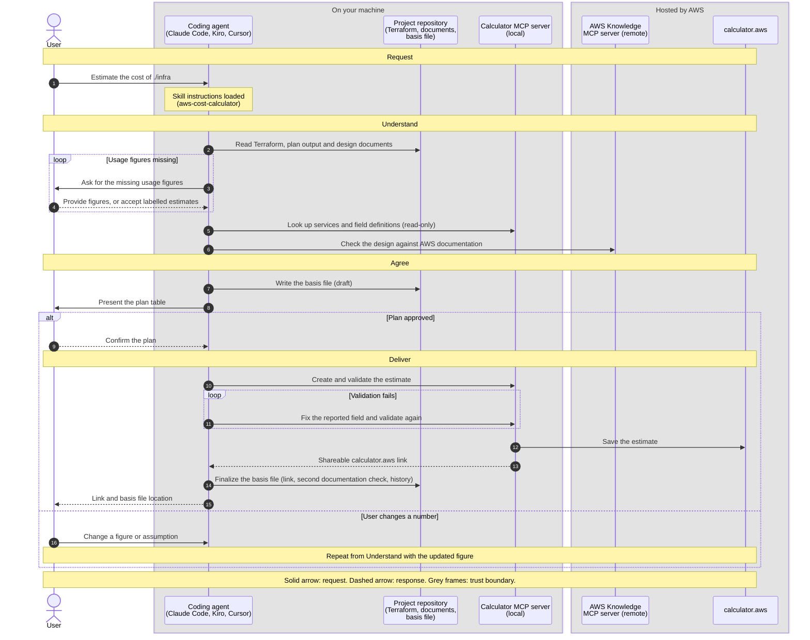

# Agent skill: aws-cost-calculator

Build [AWS Pricing Calculator](https://calculator.aws) estimates from your Terraform, design documents or a list of services, using the coding agent you already work in. Works with Claude Code, Kiro, Cursor and any other agent that supports Agent Skills and MCP.

- **Output:** a shareable `calculator.aws` link, plus a markdown file with every input and assumption behind the estimate. The file is written before the estimate is built, so it can go into git alongside the code it describes.
- **Input:** Infrastructure as Code (Terraform, CloudFormation, CDK), design documents or a list of services. The agent asks for usage figures it cannot find and marks any it has to estimate.
- **Cost:** free. No AWS credentials needed.
- **Requirements:** Node.js and internet access.
- **Setup:** install as a Claude Code plugin, Kiro Power or Cursor plugin, or by hand in any other agent. See [Setup](#setup).

## Challenges this solution addresses

Most AWS estimates are still built by hand in the [calculator](https://calculator.aws/)'s web UI. That has some well-known problems:

- **Manual and slow.** Services are added by clicking through forms, field by field, although the architecture already exists as Terraform or a design document.
- **Not reproducible.** The inputs live in a browser session and in someone's head. Another person, or the same person later, gets a different estimate, and the reasoning behind each number is not recorded.
- **Not scriptable.** The public calculator (`calculator.aws`) has no official API for creating estimates.
- **Incomplete by default.** The calculator does not prompt for common cost lines (root volumes, data transfer, backup storage, Multi-AZ, support plan) and does not model some billing details, such as management fees or minimum storage durations on archival tiers.
- **Unreliable when delegated to an AI.** Without tooling, an agent recalls prices from training data or scrapes pricing pages that render client-side. The numbers look authoritative but are not current, and no estimate exists that anyone can open.

## Why a calculator.aws link

The deliverable is a `calculator.aws` link rather than a table of numbers, because that is the format AWS cost conversations already run on:

- **Anyone can open and check it.** A customer, a colleague or a reviewer can open the link, see every service and figure, and adjust it without access to your tools. A spreadsheet or a markdown table has to be explained and trusted; a calculator estimate can be checked.
- **It works across organizations.** Customers, AWS account teams and AWS Partners all use calculator links, so an estimate can move between them in pre-sales and planning without being rebuilt.
- **AWS Partner processes expect it.** Partner Central processes such as funding requests and opportunity deal sizing expect a Pricing Calculator estimate, and Partner Central can [import a calculator link](https://aws.amazon.com/about-aws/whats-new/2025/12/aws-partner-central-opportunity-deal-sizing) directly. A custom calculation rendered as markdown is not accepted there.

## Benefits

| | Manual calculator | With this skill |
|---|---|---|
| Entering services | Re-typed in the UI, field by field | Taken from Infrastructure-as-Code or design document; the user reviews a table instead of filling forms |
| Reproducibility | Depends on the person | The same workflow every time, with every assumption listed and labelled confirmed or estimated |
| Traceability | Inputs are not recorded; a changed number cannot be explained later | A basis file in the project, written before the build; git history shows what changed between estimates |
| Verifiability | A total, possibly with a link | A `calculator.aws` link produced with AWS-calculated pricing, plus the assumptions table |
| Completeness | Whatever the user remembers | A fixed checklist of commonly missed cost lines, and documentation checks for gaps in the calculator's own model |
| Re-estimating after a change | Change and click in the UI | Change the input and re-run |

## Who it is for

- **Solutions Architects** estimating the cost of an AWS solution or a proposed design
- **Pre-sales engineers** who need an estimate that can be handed to a customer or reviewed internally
- **AWS Partner teams** preparing estimates for Partner Central processes such as opportunity deal sizing and funding requests
- Anyone who keeps an architecture in Terraform or a design document and needs the matching `calculator.aws` estimate

## How it works

The agent builds the estimate through an MCP server and follows the same steps every time:

1. **Inventory:** it lists the services from the Terraform plan, design document or user-supplied list, and asks for usage figures that were not given.
2. **Fact check:** it checks the design against current AWS documentation (AWS Knowledge MCP server) for cost components the calculator does not model, commitment-versus-workload mismatches and storage-class constraints.
3. **Record the basis:** it writes a markdown file (`cost-estimate/<name>.md` by default) with the sources, the plan table, an assumptions table that marks each input as confirmed or estimated, and the documentation findings. This happens before anything is built.
4. **Confirm:** it presents the plan table (service, sizing, key assumption) and waits for approval before anything is written to `calculator.aws`.
5. **Build:** it creates the estimate, validates it, and returns the shareable `calculator.aws` link. An estimate without a link is not considered done.
6. **Finalize:** it updates the same file with the link, the validation result, a second documentation check of the built estimate and a history row, and checks a list of commonly missed cost lines.

The basis file is plain markdown inside the project. Committed before and after the build, its git history is the changelog of the estimate: a changed assumption appears as a diff, and each rebuild adds a history row with its new link. The agent writes the file but never commits or pushes it.

### Sequence

Installing the plugin registers the skill and both MCP servers with the agent. At the start of each session the agent loads only the skill's name and description. The full instructions load when a request matches, or when the skill is invoked by name.



The basis file exists before the build, and nothing is written to `calculator.aws` until the user confirms the plan (message 9). The user can commit the basis file before and after the build.

The MCP tools behind the messages:

| Message | MCP tools |
|---|---|
| Look up services and field definitions | `search_services`, `get_service_fields` |
| Check the design against AWS documentation | AWS Knowledge server: documentation search and read |
| Create and validate the estimate | `create_estimate`, `add_service`, `validate_estimate` (or `build_estimate`) |
| Save the estimate, return the link | `export_estimate` |

### Example

Illustrative; services, figures and the link are placeholders.

```text
You:    Estimate the monthly cost of this Terraform plan in eu-west-1.
        Peak load is about 50 requests per second.

Agent:  Basis written to cost-estimate/orders-platform.md (status: draft).
        Planned estimate. Please confirm before I create it:

        | Service        | Sizing                               | Key assumption                    |
        |----------------|--------------------------------------|-----------------------------------|
        | ALB            | 1 load balancer                      | 50 req/s peak (confirmed)         |
        | ECS Fargate    | 2 tasks, 0.5 vCPU / 1 GB             | Running 24/7 (estimated)          |
        | RDS PostgreSQL | db.t4g.medium, Multi-AZ, 100 GB gp3  | Multi-AZ as in the Terraform plan |

        Documentation check: <findings, for example cost lines the calculator does not model>

You:    go

Agent:  Estimate created and validated: https://calculator.aws/#/estimate?id=<id>
        Basis updated: cost-estimate/orders-platform.md (status: built).
        Commit it to keep the estimate's history in git.
```

## Setup

**Prerequisite:** [Node.js](https://nodejs.org/en/download) and internet access. Check with `node --version`. No AWS account or credentials are needed.

The setup gives your agent two MCP servers and the skills:

| Component | Where it runs | Installed by |
|---|---|---|
| **AWS Pricing Calculator MCP server** (`pricing-calculator`), an [AWS sample project](https://github.com/aws-samples/sample-aws-pricing-calculator-mcp) that builds the estimate | On your machine, as a Node.js process that your agent starts | Downloaded automatically by `npx` the first time your agent starts it. No install command to run. |
| **AWS Knowledge MCP server** (`aws-knowledge`), which checks the design against AWS documentation | Remote, hosted by AWS | Nothing to install. Your agent only needs its URL. |
| **Skills** (`aws-cost-calculator`, `aws-cost-calculator-getting-started`) | In your agent | The plugin, or you by hand |

Choose your agent:

- [Claude Code](#claude-code): install the plugin with 2 commands
- [Kiro](#kiro): import the Power from GitHub
- [Cursor](#cursor): import the plugin from GitHub
- [Any other agent](#other-agents-manual-setup), for example GitHub Copilot or Gemini CLI: register the servers and copy the skills by hand

Then [verify the setup](#verify-the-setup).

### Claude Code

1. In a Claude Code session, add the marketplace and install the plugin:

   ```text
   /plugin marketplace add haakond/aws-cost-calculator-skill
   /plugin install aws-cost-calculator@aws-cost-calculator
   ```

   On Claude Code 2.1.275 or later, `/plugin install aws-cost-calculator --marketplace haakond/aws-cost-calculator-skill` does both in one command.

2. Choose a scope when prompted, then run `/reload-plugins` if asked.

**Check:** `claude plugin list` in a terminal shows `aws-cost-calculator` as enabled.

### Kiro

1. Open the **Powers** panel and choose **Add Custom Power** → **Import power from GitHub**.
2. Enter `https://github.com/haakond/aws-cost-calculator-skill` and choose **Install**.

**Check:** the MCP server list shows two entries ending in `pricing-calculator` and `aws-knowledge`, both **Connected**.

To install from a local clone instead, choose **Import power from a folder** and select the clone's root directory. Do not also copy the skills into `~/.kiro/skills/`; they would be registered twice.

### Cursor

1. Open **Customize** and choose **Add Marketplace** → **Import from Repo**.
2. Enter `https://github.com/haakond/aws-cost-calculator-skill`.

**Check:** both MCP servers (`pricing-calculator`, `aws-knowledge`) appear in Cursor's MCP settings, and the `aws-cost-calculator` skill appears when you type `/` in Agent chat.

If your Cursor version cannot import plugins, use the [manual setup](#other-agents-manual-setup).

### Other agents (manual setup)

1. **Register the two MCP servers.**

   | Agent | AWS Pricing Calculator MCP server | AWS Knowledge MCP server |
   |---|---|---|
   | Claude Code | `claude mcp add pricing-calculator -- npx -y sample-aws-pricing-calculator-mcp@latest` | `claude mcp add --transport http aws-knowledge https://knowledge-mcp.global.api.aws` |
   | Cursor | [One-click install](https://cursor.com/en/install-mcp?name=pricing-calculator&config=eyJjb21tYW5kIjoibnB4IiwiYXJncyI6WyIteSIsInNhbXBsZS1hd3MtcHJpY2luZy1jYWxjdWxhdG9yLW1jcEBsYXRlc3QiXX0%3D) | [One-click install](https://cursor.com/en/install-mcp?name=aws-knowledge&config=eyJ1cmwiOiJodHRwczovL2tub3dsZWRnZS1tY3AuZ2xvYmFsLmFwaS5hd3MifQ%3D%3D) |
   | VS Code / GitHub Copilot | "Install in VS Code" badge in the [server's README](https://github.com/aws-samples/sample-aws-pricing-calculator-mcp) | Add it to the MCP configuration (see the JSON below) |
   | Any other agent | Add it to the MCP configuration (see the JSON below) | Add it to the MCP configuration (see the JSON below) |

   JSON for agents that use an `mcpServers` configuration (VS Code uses a `servers` key instead):

   ```json
   {
     "mcpServers": {
       "pricing-calculator": {
         "command": "npx",
         "args": ["-y", "sample-aws-pricing-calculator-mcp@latest"]
       },
       "aws-knowledge": {
         "url": "https://knowledge-mcp.global.api.aws"
       }
     }
   }
   ```

2. **Copy the skills.** Clone this repository and copy both directories under `skills/` into your agent's skills directory. For Claude Code:

   ```sh
   git clone https://github.com/haakond/aws-cost-calculator-skill
   cp -R aws-cost-calculator-skill/skills/* ~/.claude/skills/
   ```

   For other agents, replace `~/.claude/skills/` with:

   | Agent | For all projects | For one project |
   |---|---|---|
   | Cursor | `~/.cursor/skills/` | `.cursor/skills/` |
   | GitHub Copilot | `~/.copilot/skills/` | `.github/skills/` |
   | Gemini CLI | `~/.gemini/skills/` | `.gemini/skills/` |
   | Cursor, GitHub Copilot, Gemini CLI (shared) | `~/.agents/skills/` | `.agents/skills/` |

3. **Restart the agent.** MCP servers and skills are only picked up when a session starts.

### Verify the setup

1. **Check the servers.** Ask the agent:

   ```text
   Get started with the AWS cost calculator.
   ```

   **Expected:** the version of the `pricing-calculator` server, a result from an AWS documentation search, and a short summary of the workflow.

2. **Run a small first estimate.** Pick one:

   ```text
   Estimate one t4g.small EC2 instance running 24/7 in eu-west-1 with a 20 GB gp3 volume.
   Estimate an S3 bucket with 100 GB in S3 Standard and 1 million GET requests per month in eu-north-1.
   Estimate a small web app: an Application Load Balancer, two Fargate tasks with 0.5 vCPU and 1 GB each, and a db.t4g.micro PostgreSQL instance in eu-central-1.
   ```

   **Expected:** the agent asks for any missing figures, writes `cost-estimate/<name>.md`, shows a plan table and waits. Reply `go`, and it returns a `calculator.aws` link.

3. **Check the result.** Open the link in a browser and confirm that the services, Region and figures match the plan table. Open `cost-estimate/<name>.md` and confirm that it lists the sources, the assumptions and the link.

### Troubleshooting

| Symptom | Fix |
|---|---|
| `pricing-calculator` is missing or fails to start | Check `node --version`, and check that `npm view sample-aws-pricing-calculator-mcp version` prints a version (it shows the npm registry is reachable). A blocked npm registry or a blocked `calculator.aws` also stops the server. Then restart the agent or reload the plugin. |
| `aws-knowledge` is missing or rate-limited | The estimate still works; the basis file notes that the documentation check was skipped. Retry later. |
| The agent answers without using the skill | Invoke it by name (see [Usage](#usage)) |

### Good to know

- The calculator server uses undocumented calculator APIs and can change or break without notice.
- Estimates are planning figures, not AWS quotes. Review every estimated input in the assumptions table.
- The AWS Knowledge server is rate-limited and receives the documentation queries the skill sends.

## Usage

Point your agent at whatever describes the solution: Terraform code, plan or state output, design documents, README files or architecture decision records. It identifies the AWS services and builds the estimate from there. For example:

```text
Analyze the Terraform in ./infra and produce an AWS Pricing Calculator estimate for eu-west-1.
Read docs/solution-design.md and estimate the monthly cost of the proposed architecture.
Estimate the production environment from this plan output, assuming 200 GB of data transfer per month.
```

The agent asks for any usage figures the material does not contain (request rate, data volume, run hours) before it builds anything, and it shows the plan table for approval first.

The skill starts automatically when a request is about an AWS cost estimate. To invoke it by name:

| Agent | Automatic | By name |
|---|---|---|
| Claude Code | When the request matches the skill description | `/aws-cost-calculator:aws-cost-calculator` |
| Kiro | When the request matches the Power keywords or the skill description | `/aws-cost-calculator` |
| Cursor | When the request matches the skill description | Type `/` in Agent chat and search for `aws-cost-calculator` |

### Typical use cases

1. **Cost check on Terraform before it ships.** Estimate a new module or environment from the code or the plan, so cost is reviewed alongside the change instead of after the first bill.
2. **Baselining an existing deployment.** Estimate the running cost of an environment from its Terraform, for a handover, a managed-service price or a budget conversation.
3. **Comparing design options.** Run the skill once per option (for example single-AZ against Multi-AZ, or Fargate against EKS) and compare the resulting estimates, each with its own listed assumptions.
4. **Pre-sales proposals.** Turn a design document or architecture description into a `calculator.aws` link that can be sent to the customer and adjusted together with them.
5. **AWS Partner funding and opportunities.** Produce the Pricing Calculator estimate that MAP and POC requests attach, or that Partner Central imports for deal sizing, without re-typing the architecture into the UI.

## Repository contents

| Path | Used by |
|---|---|
| `skills/aws-cost-calculator/SKILL.md` | The estimating skill ([Agent Skills specification](https://agentskills.io/specification)); every setup path |
| `skills/aws-cost-calculator-getting-started/SKILL.md` | Onboarding skill: server check, workflow overview, first prompts |
| `.claude-plugin/plugin.json`, `.claude-plugin/marketplace.json`, `.mcp.json` | Claude Code plugin and marketplace |
| `plugin.json`, `mcp.json` | Agent Plugins format: Kiro Power, Cursor plugin import |
| `scripts/check_manifests.py`, `.github/workflows/validate.yml` | CI checks |
| `.pre-commit-config.yaml`, `scripts/check-commit-msg-trailers.sh` | Local commit-msg hook |

Tool names in the skill are written as bare MCP tool names (`create_estimate`, `add_service`); each client adds its own prefix. Install steps and directory locations follow each vendor's documentation as of October 2026 and should be re-checked if a client changes. The behaviours `SKILL.md` describes as "confirmed live" (duplicate rows on re-add, group overwrite on repeated `add_service` calls) were observed against the calculator server at the time of writing and may have changed.

## Development

GitHub Actions (`.github/workflows/validate.yml`) validates the skills with the Agent Skills reference validator (`skills-ref`, pinned to a commit), validates `plugin.json` and `mcp.json` against the Agent Plugins 1.0.0 schemas, and runs `scripts/check_manifests.py`, which checks that the plugin manifests, both MCP server files and the `SKILL.md` files agree on name, version, license and the required servers. Bump the version in `plugin.json`, `.claude-plugin/plugin.json` and the frontmatter of both `SKILL.md` files together. Run `claude plugin validate .` locally before releasing; it is not part of CI.

After cloning, install the git hooks with `pre-commit install --hook-type pre-commit --hook-type commit-msg`. Plain `pre-commit install` skips the `commit-msg` hook, which rejects co-author and assistant-attribution trailers.

## License

[MIT](LICENSE.md)
